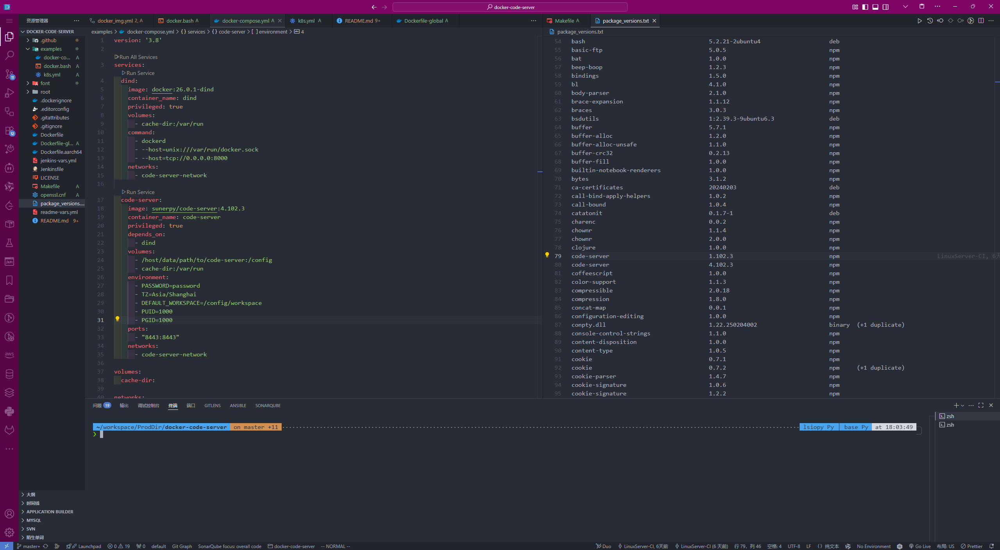

# Docker Code Server - 自定义开发环境

简体中文 | [English](README_EN.md)

[](https://www.docker.com/)
[](https://code.visualstudio.com/)
[](https://github.com/sunerpy/docker-code-server)

> 基于 [LinuxServer.io/docker-code-server](https://github.com/linuxserver/docker-code-server) 的自定义开发环境镜像

## 📖 项目简介

本项目是从 [LinuxServer.io/docker-code-server](https://github.com/linuxserver/docker-code-server) fork 而来的自定义版本，旨在提供一个**开箱即用**的云端开发环境，无需在本地安装各种开发工具。

### 🎯 项目出发点

- **环境一致性**: 通过持久化卷，在任何地方都能复现相同的开发环境
- **快速部署**: 一键启动完整的开发环境，无需复杂配置
- **资源隔离**: 容器化部署，避免本地环境污染
- **远程开发**: 基于 VS Code 的 Web 界面，支持远程开发
- **多平台支持**: 支持 Docker、Docker Compose 和 Kubernetes 部署

## ✨ 主要特性

### 🔧 预装开发工具
- **Code Server**: 基于 VS Code 的 Web IDE
- **Shell 增强**: Zsh + Oh My Zsh + Powerlevel10k 主题
- **Python 环境**: Miniconda + UV 包管理器
- **Java 环境**: OpenJDK 21
- **容器工具**: Docker-in-Docker 支持
- **云工具**: AWS CLI、Skopeo 等
- **开发工具**: Git、Vim、Maven、JQ 等

### 🚀 主要改动

相比原版 LinuxServer.io 镜像，本项目主要改动：

1. **自定义构建**: 使用 `Dockerfile-global` 进行自定义构建，可以打包常用软件和命令
2. **编程语言版本管理**: 推荐使用 [mise](https://github.com/jdx/mise) 或 [asdf](https://asdf-vm.com/) 进行多版本语言管理，而不是将开发语言版本写死在镜像中
3. **多种部署方式**: 支持 Docker、Docker Compose 和 Kubernetes 部署
4. **开发体验优化**: 预配置了丰富的开发工具和环境

## 🛠️ 快速开始

### 方式一：Docker 运行

```bash
# 基础运行
docker run -d \
    --name code-server \
    --privileged \
    -v /path/to/your/workspace:/config \
    -p 8443:8443 \
    -e PASSWORD="your_password" \
    -e TZ=Asia/Shanghai \
    -e DEFAULT_WORKSPACE=/config/workspace \
    -e PUID=1000 \
    -e PGID=1000 \
    sunerpy/code-server:latest
```

详细的 Docker 运行脚本请参考 [examples/docker.bash](examples/docker.bash)

### 方式二：Docker Compose（推荐）

```yaml
version: '3.8'

services:
  code-server:
    image: sunerpy/code-server:latest
    container_name: code-server
    privileged: true
    volumes:
      - /path/to/your/workspace:/config
    environment:
      - PASSWORD=your_password
      - TZ=Asia/Shanghai
      - DEFAULT_WORKSPACE=/config/workspace
      - PUID=1000
      - PGID=1000
    ports:
      - "8443:8443"
    restart: unless-stopped
```

启动服务：
```bash
docker compose up -d
```

完整的 Docker Compose 配置请参考 [examples/docker-compose.yml](examples/docker-compose.yml)

### 方式三：Kubernetes 部署

```bash
kubectl apply -f examples/k8s.yml
```

详细的 Kubernetes 配置请参考 [examples/k8s.yml](examples/k8s.yml)

## 🌐 访问开发环境

启动容器后，通过浏览器访问：`http://your-server-ip:8443`



## 🔧 环境变量配置

| 变量名 | 描述 | 默认值 | 必需 |
|--------|------|--------|------|
| `PASSWORD` | Web 界面登录密码 | - | 否 |
| `HASHED_PASSWORD` | 哈希密码（优先级高于 PASSWORD） | - | 否 |
| `TZ` | 时区设置 | `Etc/UTC` | 否 |
| `DEFAULT_WORKSPACE` | 默认工作空间路径 | `/config/workspace` | 否 |
| `PUID` | 用户 ID | `1000` | 否 |
| `PGID` | 组 ID | `1000` | 否 |

## 📦 语言版本管理

### 推荐使用 mise

本项目推荐使用 [mise](https://github.com/jdx/mise) 进行多版本语言管理，而不是将开发语言版本写死在镜像中。

```bash
# 安装 mise
curl https://mise.run | sh

# 安装 Node.js
mise install node@20
mise use node@20

# 安装 Python
mise install python@3.13.5
mise use python@3.13.5

# 安装 Go
mise install go@1.24.3
mise use go@1.24.3

# 安装 Rust
mise install rust@1.83.0
mise use rust@1.83.0
```

### 或使用 asdf

```bash
# 安装 asdf
git clone https://github.com/asdf-vm/asdf.git ~/.asdf

# 添加插件并安装语言
asdf plugin add nodejs
asdf install nodejs 20.0.0
asdf set -u nodejs 20.0.0
```

## 🏗️ 自定义构建

如果需要自定义镜像，可以修改 `Dockerfile-global` 文件：

```bash
# 克隆项目
git clone https://github.com/sunerpy/docker-code-server.git
cd docker-code-server

# 修改 Dockerfile-global 添加你需要的工具

# 构建镜像
docker build -f Dockerfile-global -t your-custom-code-server .

# 或直接使用makefile构建
make build-local-docker
```

## 🔍 使用技巧

### Git 配置

首次使用时，建议配置 Git 用户信息：

```bash
git config --global user.name "Your Name"
git config --global user.email "your.email@example.com"
```

### SSH 密钥配置

如需使用 SSH 进行 Git 操作，将 SSH 密钥放置在 `/config/.ssh/` 目录下。

### 扩展安装

可以通过 VS Code 界面或命令行安装扩展：

```bash
# 使用内置脚本安装扩展
install-extension ms-python.python
install-extension ms-vscode.vscode-typescript-next
```

也可以使用[vscode-syncing](https://github.com/sunerpy/vscode-syncing)插件(预发阶段)进行同步

## 🐳 Docker-in-Docker 支持

如需在容器内使用 Docker，可以启用 Docker-in-Docker (DinD) 支持：

```bash
# 启动 DinD 容器
docker run -d \
  --name dind \
  --privileged \
  --volume cache-dir:/var/run \
  docker:26.0.1-dind \
  dockerd --host=unix:///var/run/docker.sock --host=tcp://0.0.0.0:8000
```

## 📁 目录结构

```
/config/
├── workspace/          # 默认工作空间
├── .ssh/              # SSH 密钥存放目录
├── .oh-my-zsh/        # Zsh 配置
├── .local/            # 用户本地程序
└── extensions/        # VS Code 扩展
```

## 🔧 故障排除

### 权限问题

如遇到权限问题，请检查 `PUID` 和 `PGID` 设置：

```bash
# 查看当前用户 ID
id $(whoami)
```

### 端口冲突

如果 8443 端口被占用，可以修改端口映射：

```bash
-p 9443:8443  # 使用 9443 端口访问
```

### 内存不足

建议为容器分配足够的内存资源：

```bash
docker run --memory=4g --memory-swap=8g ...
```

## 📄 许可证

本项目基于 GPL-3.0 许可证开源。详见 [LICENSE](LICENSE) 文件。

## 🙏 致谢

- [LinuxServer.io](https://github.com/linuxserver/docker-code-server) - 原始项目
- [Coder](https://github.com/coder/code-server) - Code Server 项目
- [mise](https://github.com/jdx/mise) - 现代开发工具版本管理器

## 📞 联系方式

- GitHub Issues: [提交问题](https://github.com/sunerpy/docker-code-server/issues)
- 项目主页: [https://github.com/sunerpy/docker-code-server](https://github.com/sunerpy/docker-code-server)

---

⭐ 如果这个项目对您有帮助，请给个 Star 支持一下！
